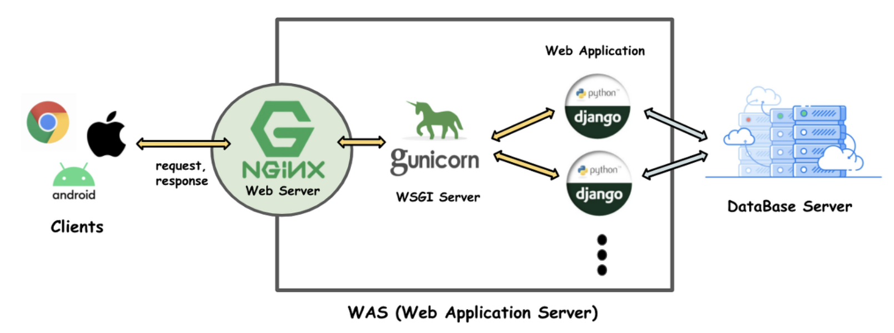

# Django 배포하기

## 기본 개념
### Web Server
> 단순히 정적 파일을 응답

### WAS(Web Application Server)
> 클라이언트 요청에 대해 동적인 처리가 이뤄진 후 응답

### WSGI(Web Server Gateway Interface)
> CGI(Common Gateway Interface)의 일종으로 여러 언어 사용자들의 다양한 요청을 이해할 수 있도록 공통된 규칙으로 변환하는 관문 역할

> Client 요청 -> CGI로 일관된 형태로 해석 -> WAS에서 처리
* CGI 기본 동작 과정
    1. Input으로 HttpRequest를 받음
    2. 요청에 대한 정보를 환경변수 형식으로 만들어 파이썬 스크립트의 stdin형식의 input으로 받음
    3. 스크립트가 print와 같은 stdout 형식으로 응답하면 HTTP 형식으로 변환


***

## 인프라 구성
<p align="center">
    
</p>


### Nginx
> Web Server 역할 : 정적 요청(html, css, image ...) 처리와 WAS의 부담을 덜어주기 위해 사용함

> 클라이언트의 요청을 처리해주는 경량 웹서버로서 정적요청은 `Nginx` 에서 자체적으로 처리하고, 동적 요청만 `Gunicorn` + `Django`에 전달하여 처리하기 위해 사용

* 장점
    1. 빠른 속도(메모리 사용량 적음)
    2. 리버스 프록시(Reverse proxy)로 사용 가능
        - 여러 WAS가 존재하면 요청 분산시키는 역할 수행 -> Load balancing
        - 캐싱 기능(WAS까지 요청하지 않아도 클라이언트 요청에 빠르게 응답)
        - WAS 정보(기기 id, MAC Address)를 숨기는 보안 역할 수행
    3. SSL 지원
    4. 웹페이지 접근 인증
        - 로그인 정보(관리자, 사용자)를 WAS에서 하지 않고 Nginx에서도 가능
    5. 비동기 처리 
        - 많은 트래픽을 동시 처리 가능

### Gunicorn

> `Nginx`가 `Django`에게 동적 요청을 전달할 수 있도록 도와주는 역할  
> `runserver`와 똑같은 역할을 수행하지만, 보안적, 성능적으로 검증되지 않았기 때문에 production 환경에서는 사용 불가  

### AWS EC2
> Amazon Elastic Compute Cloud(Amazon EC2)는 확작 가능 컴퓨팅 용량을 제공함  
* 기능  
    [EC2 참고 링크](https://docs.aws.amazon.com/ko_kr/AWSEC2/latest/UserGuide/concepts.html)
    1. 인스턴스 : 가상 컴퓨팅 환경
    2. 인스턴스 유형 : 인스턴스를 위한 CPU, Memory, Storage, Networking 등 구성 제공

### AWS RDS
> 인프라 및 데이터베이스 업데이트를 관리해주고 DB 설치, 운영, 관리를 지원하는 서비스    

> 데이터베이스 사용 방안은 2가지로 나뉨 -> RDS 사용 vs EC2에 DB 직접 설치  
> DB가 복잡한게 아니라면 EC2에 직접 설치하여도 별 문제가 없다고 보여짐

***

# Django 배포하기
`Nginx`, `Gunicorn`, `EC2`, `MySQL` 을 사용하여 배포하기


## Amazon EC2
1. 인스턴스 생성
    1. 이름 설정
    2. 애플리케이션 및 OS 이미지(Amazon Machine Image) : Ubuntu Server SSD Volumne Type(프리 티어)
    3. 인스턴스 유형 : t2.micro => 추후 데이터량에 따라 변경해야 함
    4. 키 페어 생성
    ```bash
    mkdir ~/.ssh/
    mv "키페어 파일" ~/.ssh/
    ```

2. EC2 서버에 원격으로 접속하기
    1. `ssh -i [키페어 경로] [유저 이름]@[퍼블릭 DNS 주소]`
        * init user name : ununtu   
        * public DNS Address : 생성된 인스턴스에서 확인 가능
        

3. EC2 기본 세팅
    1. `sudo apt-get update` :  패키지 정보 업데이트
    2. `sudo apt-get dist-upgrade` : 패키지 의존성 검사 및 업그레이드
    3. `sudo apt-get install python3-pip`

4. Github
    > 파일 업로드 & 버젼 관리를 위해 github를 이용해 Clone 함
    1. `sudo chown -R ubuntu:ununtu /srv/` : 클론을 위해 폴더 소유자 변경
    2. `cd /srv`
    3. `git clone [레포지토리 주소]`


## pyenv & pipenv
> Ubuntu에서 pyenv 패키지를 활용하여 python 버젼 관리
1. `pyenv install [version]` : 해당하는 파이썬 버전 install
2. `pyenv local [installed version]` 버젼 변경
3. `pipenv install` : 프로젝트에 생성되어있는 pipfile install
    * `mysql-client` error 발생 시 : 
    ```
    # Debian, Ubuntu 계열
    sudo apt-get install python3-dev default-libmysqlclient-dev build-essential
    ```
4. `pipenv shell` : pipenv 가상환경 실행


## Gunicorn
1. `pipenv install gunicorn` : 가상환경에 gunicorn 설치
2. `vi /etc/systemd/system/gunicorn.service` : 서비스 등록(서버가 재시작될때 Gunicorn도 실햄되도록 설정)
    ```
    [UNIT]
    Description=gunicron daemon
    After=network.target

    [Service]
    User=ubuntu
    Group=ununtu
    WorkingDirectory=/srv/Django-Deloyment/backend
    ExecStart=/home/ubuntu/.local/share/virtualenvs/Django-Deloyment-7ElGeabW/gunicorn --bind 0.0.0.0:8000 backend.wsgi:application

    [Install]
    WantedBy=multi-user.target
    ```
3. `sudo systemctl daemon-reload` : 시스템 데몬 재시작
    ```
    sudo systemctl start gunicorn # 서비스 실행하기
    sudo systemctl enable gunicorn # 서버 재시작시 자동으로 실행
    sudo systemctl status gunicorn.service # 실행한 서비스 상태 보기

    sudo systemctl stop gunicorn # 서비스 중지
    sudo systemctl restart gunicorn # 서비스 재시작
    ```

4. error 로그는 `/var/log/syslog`에서 확인 가능
5. nginx error log는 `/var/log/nginx/error.log` 에서 확인 가능

## EC2 보안 그룹
1. 포트를 열기 위해 `보안 그룹` => `Edit indound rules` => Custom TCP 8000 port 추가
2. `settings.py` ALLOWED_HOSTS = ["*"]

## Nginx
1. `sudo apt-get install nginx` : 서버에 nginx 설치
2. `sudo vi /etc/nginx/nginx.conf` : user 변경(ubuntu)
3. `manage.py`가 있는 디렉토리에 `.conf/nginx/[site name].conf` 생성
    ```
    server {
        listen 80;
        server_name *.compute.amazonaws.com;
        charset utf-8;
        client_max_body_size 128M;
 
    location / {
        proxy_pass  http://0.0.0.0:8000;
        }
    }


    ```
4. `sudo cp -f /srv/Django-Deloyment/backend/.confing/nginx/backend.conf /etc/nginx/sites-available/backend.conf` => `git pull` 이후 폴더에 있는 conf 파일 복사
5. `sudo ln /etc/nginx/sites-available/backend.conf  /etc/nginx/sites-enabled/backend.conf` => `sites-enabled`로 링크
6. `sudo service nginx restart`
6. 데몬 새로 고침(daemon-reload) 후 `gunicorn` 다시 실행

## STATIC & MEDIA
1. `STATIC_ROOT = os.path.join(BASE_DIR, 'static')` : `settings.py` 추가
2. `python manage.py collecstatic`
3. `backend.conf` 수정

## Amazon RDS
[참고 링크](https://bcp0109.tistory.com/357)
1. RDS 데이터베이스 생성
2. EC2 연결 -> 보안그룹 설정 잘 해야함 -> 아직 제대로 이해 못함 -> 링크 참고
3. MYSQL Workbench를 사용하여 로컬 PC에서 접속
    * Create Schema -> DATANASES -> Name 입력
    
4. EC2에서 접속
    * `sudo apt-get update`
    * `sudo apt-get install mysql-server`
    * `mysql -u [user] -p --gost [end point]

## Domain 연결하기

