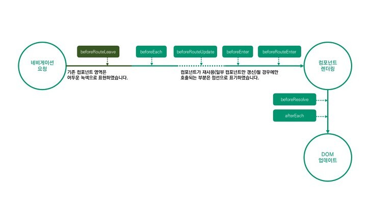

# 네비게이션 가드
<p align="center">
    
</p>
> 주로 리다이렉션하거나 취소하여 네비게이션을 보호하는 데 사용  
> Params 또는 쿼리를 변경하면 실행되지 않음 => `$routes` 객체를 `watch`하고 그 변화에 반응함

## Global Guards
>`router.beforeEach`를 사용하여 보호하기 이전에 전역 등록
```javascript
const router = new VueRouter({ ... })

router.beforeEach((to, from, next) => {
    /// ...
})
```
* `to: 라우트` : 대상 Route 객체로 이동
* `from: 라우트` : 전 라우트로 이동
* `next: 함수`
    * `next()`: 파이프라인의 다음 훅으로 이동
    * `next(false)`: 현재 네비게이션을 중단 -> `from`경로의 URL로 재설정
    * `next('/')`: 다른 위치로 리다이렉션 -> 새 네비게이션이 시작
    * `next(error)`: `next`에 전달된 인자가 `Error`의 인스턴스이면 탐색이 중단


## Global Resolve Guards
> `router.beforeEach`와 유사하나, 모든 컴포넌트 가드와 비동기 라우트 컴포넌트를 불러온 후 네비게이션 가드를 확인하기 전에 호출됨  


## Global After Hooks
> 가드와 달리 이 훅은 `next`함수를 얻지 못하며 네이게이션에 영향을 줄 수 없음
```javascript
router.afterEach((to, from) => {
    // ... 
})
```


## 라우트 별 가드
```javascript
const router = new VueRouter({
    routes: [
        {
            path: '/foo',
            component: Foo,
            beforeEnter: (to, from, next) => {
                // ....
            }
        }
    ]
})
```


## 컴포넌트 내부 가드
* `beforeRouteEnter` : 가드는 네비게이션이 확인되기 전에 가드가 호출되어서 새로운 엔트리 컴포넌트가 생성되기 전 =>  `this` 접근X
* `beforeRouteUpdate` : 
* `beforeRouteLeave` : `this` 접근 가능

