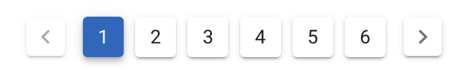

# Vuetify Component 정리
## v-pagination
<p align="center">
    
</p>

> 긴 데이터 셋을 분리하는데 사용함.
> 데이터량이 많지 않은 경우는 `mounted` or `created` 단계에서  데이터를 당겨와 나누면 되지만, 데이터가 많은 경우는 `pagination button` 을 클릭할 때 api를 호출하는것도 괜찮아 보임.
```html
<v-pagination
      v-model="page"
      :length="5"
    >
</v-pagination>
```
